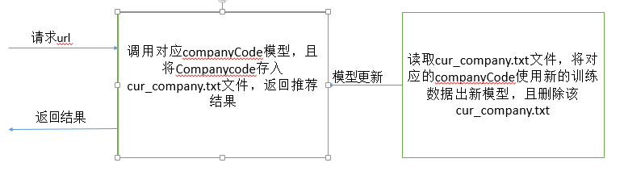

# 定时任务、接口

## 1、接口

###  1.1 推荐接口

类型：POST

URL：/recommend

请求参数：

```
{companyCode:"vranym"}
```

| 名称          | 类型     | 允许为空 | 描述     |
| ----------- | ------ | ---- | ------ |
| companyCode | String | NO   | 公司code |

返回示例：

{'returnCode': 1, 'data': ['00005988380c11e7abbe00163e006499:0.966426135055', '00005ad06c3011e696a500163e006499:0.97667924131', '00005bfe76d811e6b8db00163e006499:0.966426135055', '00005d426a0911e696fb00163e006499:0.97667924131', '00005de0381411e7852500163e006499:0.97667924131', '00005edc717e11e7993b00163e006499:0.98196712176', '00005fca3a6c11e7bae500163e006499:0.966426135055', '00006022a39c11e689dc00163e006499:0.98196712176']}

返回参数：

| 名称         | 类型   | 允许为空 | 描述         |
| ---------- | ---- | ---- | ---------- |
| returnCode | int  | NO   | 正确：1；错误：-1 |
| data       | list | YES  | 返回推荐的线索id  |

###    

### 1.1 2地图搜索-用户添加公司处理

  类型：POST

  URL:

  请求参数：

| 名称         | 类型   | 允许为空 | 描述   |
| :--------- | ---- | ---- | ---- |
| companCode |      |      |      |

  返回示例：


  返回参数：


## 2、定时任务

### 2.1  有效性评分定时任务

​    涉及到的文件： validity_score.py  timer_validity_score.py       

​    功能说明：计算每个线索在被打过之后的可推荐程度，该评分涉及到时间，线索被                打数量，因此是一个持续更新计算的过程，每周凌晨重新计算评分。

### 2.2  导入的客户数据添加线索ID

​    涉及到文件：plan_customer_alter_timer.py  plan_customer_alter.py

    功能说明：crm_t_plan_customer表中添加Clue_Key字段，该字段是线索的id，将用户行为与线索联系起来
### 2.3 定时更新推荐模型

​    update_model文件夹-   model_timed_task文件夹-model_update_task.py

​    功能说明：维护每一个客户推荐模型，非实时生成，只有用户在当天使用时，模型会在当天凌晨更新