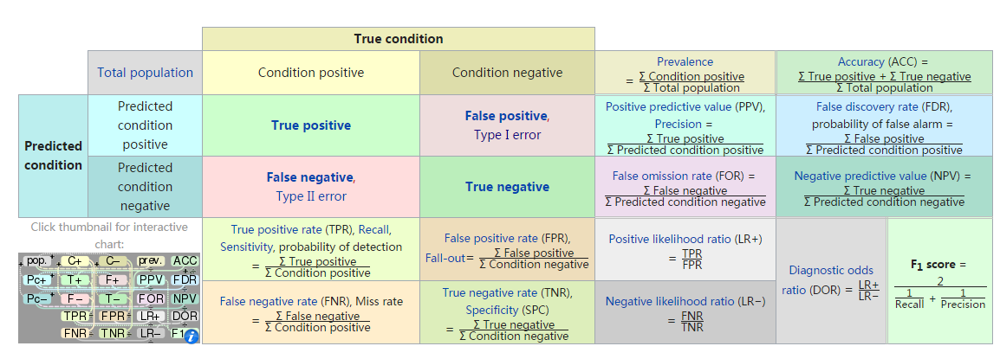

# 机器学习理解

## 训练集、测试集和验证集关系理解

训练集 train set：通过学习一些参数建立一个分类器，建立一种分类方式，用于训练模型。

测试集 test set：测试训练好的模型的分辨能力

验证集 validation set：对学习出来的模型，调整分类器参数，还用来确定网络结构或控制模型复杂程度的参数

## 偏差、方差关系

偏差：描述预测值的期望和真实值之间的差距，偏差越大，越偏离真实数据

方差：描述预测值的变化范围，离散程度，也就是离其期望值的距离，方差越大，数据的分布越分散

## AUC值、 ROC曲线、 F1-score、  RMSE、 正确率、 精确率（查准率）、 精确率（precision）、召回率（查全率）

混淆矩阵：

|       | 预测正样例              | 预测负样例              | 总计      |
| ----- | ------------------ | ------------------ | ------- |
| 真实正样例 | TP(True Positive)  | FN(False Negative) | P（实际为正） |
| 真实负样例 | FP(False Positive) | TN(True Negative)  | N（实际为负） |
| 总计    | P_（被分为正）           | N_（被分为负）           |         |

正确率（accuracy）：(TP+TN)/(P+N),被分对的样本数除以所有样本数，值越高，分类器越好

精度（precision，精确度）：TP/(TP+FP),表示被分为正样例的样本中实际上是正样本的比例

召回率（recall）：覆盖面的度量，度量有多少个正样本被分为正样本，recall=TP/(TP+FN)=TP/P=灵敏度

灵敏度（sensitive）：TP/P ,所有正样本被分对的比例，衡量分类器对正样本的识别能力

特效度（specificity）：TN/N, 所有负样本被分对的比例，衡量了分类器对负样本的识别能力

F1-score (https://en.wikipedia.org/wiki/F1_score):召回率和精度的调和平均数，2*( (precision *recall )/( precision+recall ))

SSE(和方差、误差平方和):拟合数据和原始数据对应点的误差平方和

RMSE(均方根): sqrt(MSE)=sqrt(SSE/n)

MSE（均方差）: SSE/n  (n为样本个数)

R-square（确定系数）:

R-square=SSR/SST=(SST-SSE)/SST=1-(SSE/SST)；SSR 预测数据与原始数据均值之差的平方和； SST 原始数据与原始数据均值之差的平方和

AUC值，roc曲线：

 

## 模型训练中内存受限处理方法：

